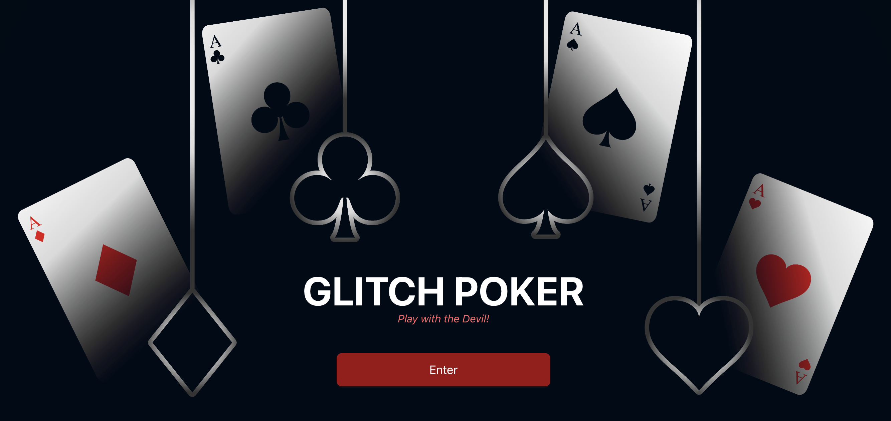
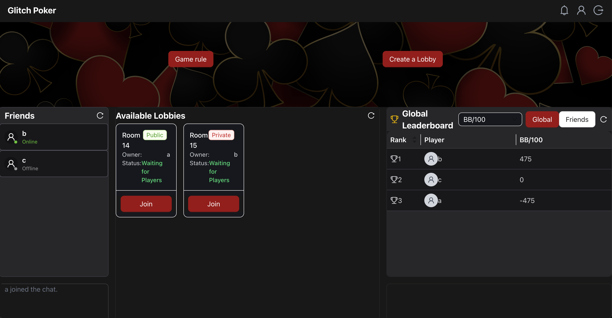
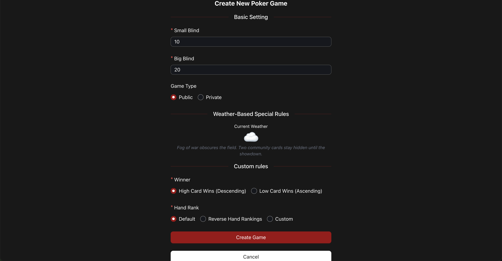
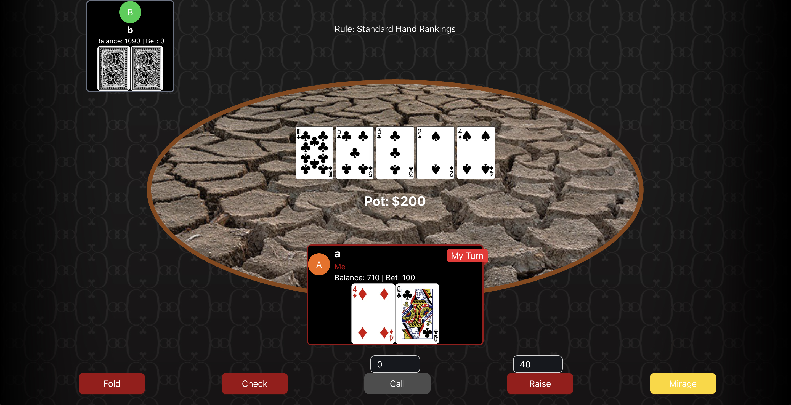

# Glitch Poker Frontend

---

## Introduction

**Glitch Poker** is an online poker application focused on delivering a **customizable and social poker experience**. Our goal is to provide a platform where users can enjoy classic poker with the flexibility to add custom rules, weather-based effects, and social features like friends and chat.

Only **authenticated users** can join games, create lobbies, and challenge friends directly. Lobby creators have the power to define custom rules, adjust hand rankings, and even apply special rules based on real-world weather. We built Glitch Poker to offer a more diverse and enjoyable poker experience than existing platforms.

---

## Technologies Used

* **Frontend:** React (Next.js), TypeScript, Ant Design
* **State & Data:** REST API, WebSockets

---

## High-Level Components

* **Lobby Management:** Handles the creation, listing, and joining of game lobbies.
    * [Lobby List Component](app/components/main/lobbyList.tsx)

* **Game Table & Gameplay:** Renders the poker table, manages in-game actions, and applies custom/weather rules.
    * [In-Game Layout](app/components/game/inGameLayout.tsx)

* **Friends & Social:** Allows users to add friends, view their status, and invite them to games.
    * [User Profile Card](app/components/friends/UserProfileCard.tsx)

* **Leaderboard & Statistics:** Displays global and friends-only leaderboards with key poker stats.
    * [Leaderboard](app/components/main/leaderboard/leaderboard.tsx)

* **Custom Rules & Special Actions:** Supports custom winner rules, hand rankings, and weather-based special actions.
    * [Create Lobby Page](app/main/create-lobby/page.tsx)

---

## Launch & Deployment

### Prerequisites

* Node.js (v18+)
* Deno (for lockfile)
* Docker (optional)
* Nix (optional)
* Backend server running (see backend repo)

### Setup Steps

1.  **Install dependencies:**
    ```sh
    npm install
    ```
2.  **Run the development server:**
    ```sh
    npm run dev
    ```
3.  **Build for production:**
    ```sh
    npm run build
    npm start
    ```
4.  **External Dependencies:** Requires the backend API and WebSocket server to be running.

---
## Illustrations
1. Landing Page
   * Players should register or login to enjoy the game.


2. Main Page
   * **Game Rule**: This section explains the basic rules of poker, along with the custom rules and special effects specific to Glitch Poker. 
   * **Friends Scetion & Chat**: Players can view their friends’ online status and chat via text.
   * **Lobby List**: PPlayers can join existing lobbies or create their own. 
   * **Leaderboard** : Displays the scores of all players, including friends.



3. Create Lobby
   * When creating a lobby, the player can choose custom rules.
   * Based on the host's location, the weather and weather-based rules are automatically applied.(Players can change weather-based rules through voting.)
   * The host can make the private lobby with a password.


4. In-game
   * Players can either nomal poker games and those with custom rule or special effects.
   * The image of the game table switches according to weather.
   * Maximum 5 plyaers can play the poker game together.



---

## Roadmap

* **In-game Text Chat:** Add chat functions within each lobby so players can communicate during the game.
* **Mobile Support:** Improve UI/UX for mobile devices.

---

## Authors & Acknowledgement

* @arden333: Frontend
* @RealBlueSwan: Frontend
* @elio42: Backend
* BeCre11how: Backend

We'd like to thank our TA, Timon Leupp for guidance and support throughout the development of this project as part of the Software Engineering Lab course at the University of Zurich.

---

## License
Apache 2.0